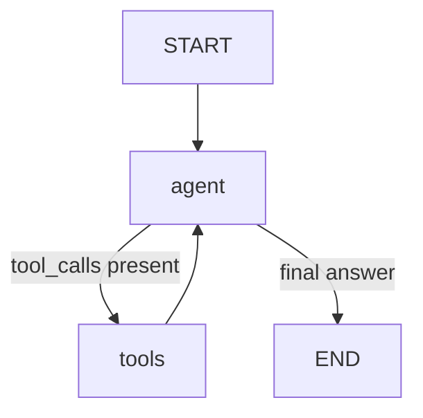

# Personal Budget Guardian

A read-only ReAct agent, built with LangGraph, that answers questions about a
user's spending, budget caps, and goals from a local SQLite database and a
couple of static reference files — and refuses, on purpose, to do anything
else.

Built for the McCombs/GreatLearning "Business Applications with Agentic AI"
module, then extended past the coursework scope to run against a real Amex
statement export instead of only toy data.

## Why a repo, not a notebook

Notebooks let you run cells out of order and hide state bugs. This repo
forces the graph to run start-to-finish as a script, which is closer to how
you'd actually ship an agent — and it makes the ReAct loop's tool-call trace
something you can read top to bottom instead of reconstructing from
out-of-order cell output.

## Why this project

A single-agent ReAct system that answers spending questions from a user's
own transaction history — deliberately **read-only**: no tool can write to
the database, send money, or give investment advice. The interesting problem
here isn't "can an LLM call some tools," it's a real constraint in
consumer-facing financial AI: how do you build an assistant that's genuinely
useful for reporting facts about someone's money, without it drifting into
advice it has no business giving?

Two boundaries the agent has to respect on every turn:
- **No writes.** "Add a transaction" or "update my income" must be refused —
  not because the prompt says no, but because no tool in `agent_tools.py`
  performs a write. There is no `INSERT`/`UPDATE` path to social-engineer
  the model into.
- **No advice.** Investment, tax, retirement, and insurance questions get a
  fixed escalation line, not a helpful-sounding answer.

## What it does

```
$ python src/agent.py
```

Runs a hardcoded scenario (see `src/agent.py`'s `__main__` block) through the
compiled graph and prints the final message. For a broader spot-check across
several prompt types, run:

```
$ python src/test_scenarios.py
```

which fires 6 prompts at the agent and prints every message in the
resulting trace — a normal query, an empty-data category, a write attempt,
an investment-advice attempt, a category comparison, and a retirement
question. These aren't automated `pytest` assertions; they're meant to be
read by a human reviewing whether the trace looks right (which is exactly
what the coursework rubric asks for).

## Architecture

A single-node ReAct loop: the LLM either calls a tool or produces a final
answer, and any tool call routes back through the same node until it stops
calling tools.



- **`agent` node** (`agent.py:agent_node`) — binds all 7 tools to the LLM and
  invokes it with the running message list.
- **`tools` node** — a LangGraph `ToolNode` that executes whichever tool the
  model requested and appends the observation as a `ToolMessage`.
- **Conditional edge** (`should_continue`) — loops back to `agent` while
  `tool_calls` is non-empty, otherwise routes to `END`.

State is a single `messages` list accumulated with LangGraph's `add_messages`
reducer — no other state is threaded through the graph, which keeps the
whole thing legible at the cost of the model having to re-derive context
(like `user_id`) from the system prompt every turn.

## Tools

`tools.py` holds plain functions that take a `sqlite3.Connection` as their
first argument and return dicts/lists — no LangChain imports, no
decorators. `agent_tools.py` wraps each one in a closure that captures the
connection and exposes it as an `@tool`-decorated function the model can
call:

| Tool | Reads from | Purpose |
|---|---|---|
| `get_user_profile_tool` | `users` table | Name, monthly income, currency |
| `get_recent_transactions_tool` | `transactions` table | Most recent N transactions |
| `search_transactions_by_merchant_tool` | `transactions` table | Partial-match merchant search |
| `total_spend_by_category_tool` | `transactions` table | Spend grouped by category |
| `list_top_merchants_tool` | `transactions` table | Top N merchants by spend |
| `get_category_cap_tool` | `data/category_caps.json` | Spending cap for a category |
| `get_budget_template_tool` | `data/budget_templates.json` | Named 50/30/20-style allocation |

Splitting it this way means the actual data-access logic in `tools.py` can be
called and checked directly from a plain Python shell (see
`src/test_tools.py`) without spinning up an LLM or a graph — the LangChain
wrapping is a thin adapter layer, not where the logic lives.

## Data layer

Two different storage shapes for two different kinds of data:

- **SQLite** (`data/budget_guardian.db`) for anything that's genuinely
  relational and queryable — `users`, `transactions`, `goals` (goals table
  exists in the schema but is currently unpopulated/unused by any tool).
- **Static JSON reference files** (`data/category_caps.json`,
  `data/budget_templates.json`) for small, mostly-fixed lookup tables that
  don't need `WHERE` clauses — category caps and budget templates. These are
  intentionally *not* in SQLite; a dict lookup is simpler and the values
  rarely change.

## Real-world data extension

The coursework only required toy data. To stress-test the design against
something messier, `src/load_data.py` parses a real Amex statement export
(`data/raw/amex.csv`, gitignored — it's genuinely personal financial data)
and loads it into the same `transactions` table the toy data used.

The category caps in `data/category_caps.json` are keyed on Amex's own
category taxonomy verbatim (e.g. `"Merchandise & Supplies-Groceries"`,
`"Travel-Airline"`) rather than a taxonomy invented for this project — see
[Learnings](#learnings) below for why that mattered.

## Setup

```bash
python -m venv .venv
source .venv/bin/activate        # Windows: .venv\Scripts\activate
pip install -r requirements.txt
cp .env.example .env
```

Fill in `.env` with:
- `OPENROUTER_API_KEY` — the agent calls an OpenRouter-hosted model via
  `ChatOpenAI` (see [Learnings](#learnings) for why this isn't
  `ANTHROPIC_API_KEY` despite `.env.example`).
- `LANGSMITH_TRACING`, `LANGSMITH_API_KEY`, `LANGSMITH_PROJECT` — optional,
  only needed if you want traces in LangSmith (see Observability below).

```bash
python src/db_setup.py           # idempotent: creates schema, seeds one user if empty
python src/agent.py              # runs the sample scenario, prints the final answer
python src/test_scenarios.py     # runs 6 scenarios, prints the full message trace for each
```

`data/budget_guardian.db` is checked into the repo already seeded with 288
real transactions, so the two run commands above work out of the box without
needing `load_data.py`.

## Observability

`src/export_traces.py` pulls root runs for the `LANGSMITH_PROJECT` project
via the LangSmith SDK and dumps them to `exported_traces.json`. This was the
mechanism used to pull actual tool-call traces out for the rubric's "trace
review" requirement, instead of copy-pasting terminal output by hand.

## Learnings

**The strongest guardrail is a missing tool, not a prompt instruction.**
The system prompt tells the model not to write data, but the reason "Add a
transaction" reliably fails isn't the instruction — it's that `agent_tools.py`
never registers a write-capable tool in the first place. A prompt is
persuasion; an absent code path is a guarantee. If this agent's guardrails
had to survive an adversarial user, this project would need `INSERT`/`UPDATE`
permission errors enforced at the SQLite connection level as well, since a
sufficiently different prompt injection could still coax the model into
*trying* to justify writes even without a tool to do it — the current design
only prevents the *action*, not the *attempt*.

**Real category taxonomies are not something you get to invent.**
The original plan was a small, clean set of budget categories. Once real
Amex data entered the picture, the categories turned out to be two-part
strings like `Merchandise & Supplies-Groceries` and `Travel-Airline` — the
issuer's own taxonomy, not a friendlier one designed for this project. The
caps file had to be keyed on the issuer's strings, not the other way around.
This is a small-scale version of a real integration problem: your data model
often has to bend to the shape of the upstream system, not vice versa.

**Separating "what a tool does" from "how the model calls it" pays off
immediately.** Keeping `tools.py` as plain functions and `agent_tools.py` as
the LangChain adapter meant every tool could be manually verified
(`test_tools.py`) against the real database before ever involving the LLM.
Bugs in data access and bugs in tool-calling behavior are different failure
modes, and this split makes it possible to rule one out before debugging the
other.

**A model-agnostic client made the LLM choice a config decision, not an
architecture decision.** `config.py` originally sketched a `ChatAnthropic`
client; the shipped agent uses `ChatOpenAI` pointed at OpenRouter's endpoint
instead. Because LangGraph's `ToolNode`/`bind_tools` machinery is provider-
agnostic, swapping providers only touched `agent.py`'s client construction —
nothing about the graph, the tools, or the system prompt had to change. (The
leftover `config.py` stub and the stale `ANTHROPIC_API_KEY` in
`.env.example` are the paper trail of that pivot — see the unused-files note
below.)

**A fixed refusal string is more testable than an open-ended one.** The
system prompt asks the model to respond with the exact sentence *"That's
outside what I can help with — please talk to a human financial advisor."*
for out-of-scope requests, rather than "politely decline." An exact string
is something you can `grep` for in a trace or assert on in a test; "politely
decline" produces a different sentence every run and can't be checked
mechanically.

**Manual trace review substitutes for automated tests when the thing under
test is a probabilistic model.** There's no `assert` in `test_scenarios.py`
because the interesting failure modes (does it fabricate a number for a
category with zero transactions? does it slip into giving advice on a
reframed question like "insurance for retirement"?) aren't things a plain
equality check catches — they need a human reading the trace. That's a real
limitation of testing LLM agents versus testing deterministic code, not an
oversight.

**Idempotent setup scripts save you from yourself.** `db_setup.py` uses
`CREATE TABLE IF NOT EXISTS` and only seeds the user row `if count == 0` —
so re-running setup after the database already has real transaction history
in it doesn't wipe anything out. Worth doing by default for any script that
touches state you don't want to regenerate every run.

## Project structure

```
personal-budget-guardian/
├── data/
│   ├── budget_guardian.db     # SQLite: users, transactions, goals — checked in, pre-seeded
│   ├── category_caps.json     # static reference: per-category spending caps
│   ├── budget_templates.json  # static reference: 50/30/20-style allocation templates
│   └── raw/amex.csv           # gitignored real statement export, input to load_data.py
├── src/
│   ├── agent.py                # AgentState, graph, ReAct loop, main()
│   ├── agent_tools.py          # LangChain @tool wrappers around tools.py
│   ├── tools.py                # 7 plain data-access functions (DB + JSON reads)
│   ├── db_setup.py             # schema + idempotent seed
│   ├── test_scenarios.py       # manual trace review across 6 prompts
│   ├── test_tools.py           # manual smoke test of tools.py against the real DB
│   ├── load_data.py            # one-off: parses amex.csv into the transactions table
│   ├── explore.py              # one-off: pandas exploration of amex.csv
│   ├── export_traces.py        # pulls LangSmith traces into exported_traces.json
│   └── config.py               # unused — early ChatAnthropic sketch, superseded by agent.py's OpenRouter client
├── tests/
│   └── test_cases.py           # unused — TEST_CASES list, not wired into any runner
└── docs/
    └── architecture.md         # graph diagram + negative-constraint notes
```

## Status

- [x] Data layer (SQLite + JSON reference files)
- [x] Tool registry (7 tools)
- [x] Agent graph (state, nodes, routing)
- [x] Manual test scenarios + trace review
- [ ] Automated (`pytest`-style) test suite — currently all verification is manual/print-based
- [ ] `.env.example` still lists `ANTHROPIC_API_KEY`; actual runtime needs `OPENROUTER_API_KEY`
- [ ] Conclusions / business recommendations
