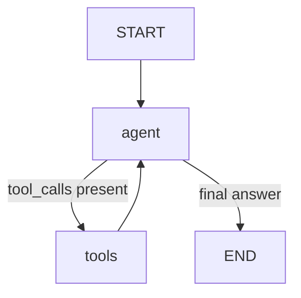

# Agent Graph

Paste the output of `app.get_graph().draw_mermaid()` below once agent.py compiles.

## Nodes
- **agent**: LLM decides next tool call or gives final answer
- **tools**: executes whichever tool was requested, returns observation
- conditional edge loops until no more tool_calls

## Negative constraints enforced in SYSTEM_PROMPT
- No writes to the database
- No investment / tax / legal advice
- Escalates to human advisor on those topics, or after 2 tool failures
